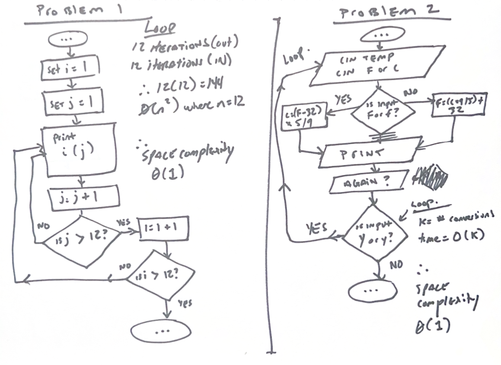
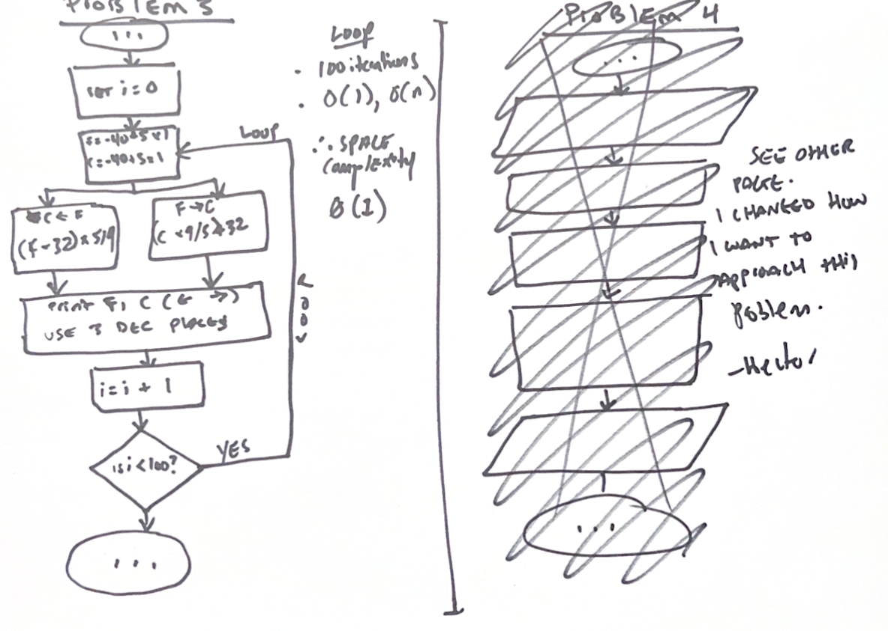
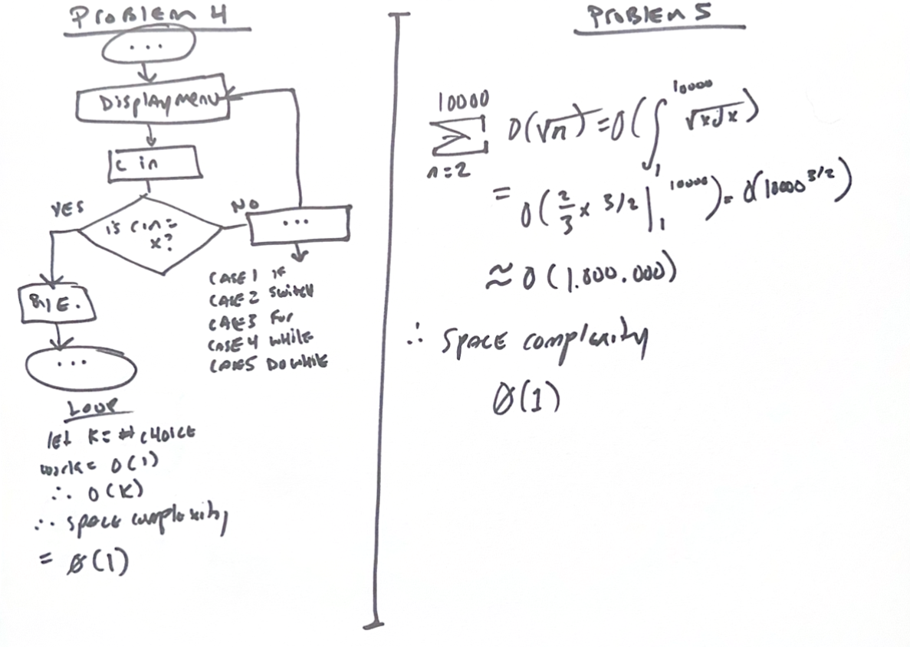

Assignment one journal
++++++++++++++++++++++++

+--------------+----------------------+
| Time spent   | Jan 2026 to Aug 2026 |
+--------------+----------------------+
| Student name | Hector Barquero      |
+--------------+----------------------+

.. tip::
   **How to use this journal**
   
   Each assignment has it's own chapter. Use the right chapter to grade the assignment, which has program design notes, changelogs for versions as I made updates, reflections, and reading notes for the units of each assignment. There's also practice questions from the textbook which were recommended to be added to the learning journal for each assignment chapter. If a chapter is missing, it means that assignment isn't done yet because they're being completed sequentially-- not all at the same time.

Program design
===============

Assignment 1, Problem 1
~~~~~~~~~~~~~~~~~~~~~~~~~~~~~~~~~
- Added nested for loops for the row and column values. (v1.0)
- Used setw to align three-character row labels and four-character products. (v1.1-v1.5)
- Compared the generated first and final rows with the supplied table. (v1.5)
- Corrected the first-column width so the vertical bars align with the sample.(v1.5-v1.7)

Assignment 1, Problem 2
~~~~~~~~~~~~~~~~~~~~~~~~~~~~~~~~
- Added a repetition loop for multiple conversions. (v1.0)
- Implemented both temperature formulas using double values. (v1.0)
- Accepted uppercase and lowercase F, C, Y and N. (v1.0)
- Added input checks for non-numeric temperatures and unsupported units. (v1.2)
- Added extra support and redesigned program a bit to handle when user enters temp as string not int or double. (v1.2)
- Verified 32 F converts to 0 C, 100 C converts to 212 F and -40 converts to -40 in either direction. (v1.2)

Assignment 1, Problem 3
~~~~~~~~~~~~~~~~~~~~~~~~~~~~~~~~
No changelog - was able to solve this in one attempt given similarity to previous problems.

- Added static functions for Fahrenheit-to-Celsius and Celsius-to-Fahrenheit. (v1.0)
- Generated exactly 100 rows beginning at -40 and increasing by 5. (v1.0)
- Used fixed, setprecision(3) and setw for table formatting. (v1.0)
- Verified the first row, the 100-degree row and the final 455-degree row. (v1.0)

Assignment 1, Problem 4
~~~~~~~~~~~~~~~~~~~~~~~~~~~~~~~~
- Added a repeating menu implemented with a do-while loop. (v1.0)
- Added switch cases for if, switch, for, while and do-while. (v1.1)
- Added invalid-selection handling and support for x or X to exit. (v1.2)
- Verified each menu option and both exit characters. (v1.3)

Assignment 1, Problem 5
~~~~~~~~~~~~~~~~~~~~~~~~~~~~~~~~~~~~~
- Added nested for loops and the modulus operator for prime detection. (v1.0)
- Began candidate testing at 2 because 1 is not prime. (v1.1)
- Limited divisor testing to divisors whose square is no greater than the candidate. (v1.2)
- Formatted the output as ten prime numbers per row. (v1.2)
- Verified that 2 is the first prime, 9973 is the final prime and 1,229 primes are produced from 1 through 10,000. (v1.3)

Overview and reflections
=========================

Unit 1: Points to ponder
~~~~~~~~~~~~~~~~~~~~~~~~~
Hector Barquero posted Feb 27, 2026 8:12 AM
https://learning.athabascau.ca/d2l/le/18658/discussions/threads/337601/View?ou=18658

I've programmed in C, C++ a lot and reading these feels like a nice refresher. 

I've been programming in javascript a lot lately, so I almost forget definitions of things and some of the differences feel jarring. I caught myself forgetting that C++ doesn't do hoisting, and I forgot how strict it is with type declaration... Reading this content again has me remembering I have some javascript habbits to break.

I also appreciate that both Think C++ and The Rooks Guide especially are really short and direct. I thought at first that they were quite dated, but I guess depending where you work... the C++ standard you might be writing could be dated too. (Where I am, I think it's an archaic standard, and the job previous to that we weren't using the latest either)

Unit 2: Points to ponder
~~~~~~~~~~~~~~~~~~~~~~~~~
Hector Barquero posted Feb 27, 2026 10:19 AM
https://learning.athabascau.ca/d2l/le/18658/discussions/threads/337650/View

Completing unit 2 was interesting because it has differences to modern c++ that I needed to refresh on. I recall learning the same traditional academic declarations when first studying c++ at Fanshawe College in 2016: 

//academic and traditional declaration the books seems to prefer:
int foo = 0;

but when I started working in 2018+, I used brace form since it's modern best practice with c++:

//brace form which i think is c++ v11 and on, considered best practice to protect narrowing
int foo{0};

This might be another thing for me to remember since I'm used to protecting type narrowing when doing narrowing conversion, but I scanned ahead for other units and see that the text prefers explicit casting conversion.

This is all really good for me to read again because in javascript, everything is dynamically typed where the type belongs to the value, not the variables

Unit 3: Points to ponder
~~~~~~~~~~~~~~~~~~~~~~~~~
Hector Barquero posted Feb 27, 2026 1:27 PM
https://learning.athabascau.ca/d2l/le/18658/discussions/threads/337734/View

This unit was a good read. I spent a lot of time between multiple books this unit (including a javascript one I read yearly; eloquent javascript). I found there was a lot of reading that I thought I knew in the c++ books, but then it became blurry as I applied it in programming practice questions and tests- mainly because the casting, conversion, implicit coercion and explicit casting/conversion. 

C++ prefers very deliberate programmer directed type conversion, but unlike javascript, the coercion happens less frequently.

javascript mutates the types more freely so coercion feels like something to always watch for, and programming explicit casting (conversion in js) is something normal.

I'm not sure how often I'll need to in this course, but I'll remember to use static_cast<var> or various named casts in my c++ programs, since the last time I touched it  we used the more archaic int foo = (int)bar; ... a C style cast which doesn't seem to be used or popular in the books anymore.

Readings
=========

Unit 1
~~~~~~~

.. rubric:: ThinkCScpp 1.1: What is a programming language?

- A programming language provides formal rules for expressing instructions a computer can execute.
- High-level languages like C++ must be translated into machine language before they can run.

.. rubric:: ThinkCScpp 1.2: What is a program?

- A program is a sequence of instructions that performs computation, input, output, testing, and repetition.

.. rubric:: ThinkCScpp 1.3: What is debugging?

- Debugging is the process of finding and correcting errors in a program.
- Errors generally fall into compile-time, run-time, and logic categories.
- Debugging requires testing assumptions rather than randomly changing code.

.. rubric:: ThinkCScpp 1.3.1: Compile-time errors

- Compile-time errors prevent the compiler from translating the source code.
- They commonly result from invalid syntax, missing punctuation, or incorrect declarations.

.. rubric:: ThinkCScpp 1.3.2: Run-time errors

- Run-time errors occur after compilation while the program is executing.
- A program might crash, stop unexpectedly, or perform an invalid operation.
- The compiler can't always detect conditions that only appear during execution.
- Testing different inputs helps identify when the failure occurs.

.. rubric:: ThinkCScpp 1.3.3: Logic errors and semantics

- Logic errors produce incorrect results even though the program compiles and runs.
- Semantic errors happen when valid code doesn't express the intended meaning.

.. rubric:: ThinkCScpp 1.3.4: Experimental debugging

- Experimental debugging uses controlled tests to confirm or reject explanations for an error.
- Debug output can reveal variable values and show which statements execute.
- Changing several things at once makes it harder to identify the actual cause.

.. rubric:: ProgFund 1: Introduction to Programming

- Programming converts a problem-solving process into instructions a computer can follow.
- Programs typically accept input, process data, and produce output.
- Good programming requires planning, implementation, testing, and maintenance.

.. rubric:: ProgFund 1.1: Systems Development Life Cycle

- The SDLC organizes software work into planning, analysis, design, implementation, testing, and maintenance.
- Each phase reduces uncertainty before more development effort is committed.

.. rubric:: ProgFund 1.3: Modularization and C++ Program Layout

- Modularization divides a large problem into smaller functions with specific responsibilities.
- A C++ program normally contains directives, declarations, functions, and a ``main`` function.
- Smaller modules are easier to test, reuse, and understand.
- Clear layout helps readers recognize the program's structure quickly.

.. rubric:: ProgFund 2: Program Planning & Design

- Program planning defines the problem and solution before code is written.

.. rubric:: ProgFund 2.1: Program Design

- Program design identifies inputs, processing steps, outputs, and required decisions.
- A planned solution is easier to implement and test than an improvised one.
- Complex problems should be divided into manageable modules.

.. rubric:: ProgFund 2.2: Pseudocode

- Pseudocode describes program logic using structured language without strict C++ syntax.
- It helps refine algorithms before implementation details become a distraction.

.. rubric:: ProgFund 2.3: Test Data

- Test data checks whether a program handles normal, boundary, and invalid inputs correctly.
- Expected results should be decided before the program is executed.
- One successful test can't prove that every possible input works.
- Carefully selected cases can expose incorrect conditions and assumptions.
- Tests should be repeated after changes to detect regressions.

.. rubric:: ThinkCScpp 1.4: Formal and natural languages

- Natural languages tolerate ambiguity, while formal languages require precise syntax and structure.
- C++ can't infer intended meaning when its grammatical rules aren't followed.

.. rubric:: ThinkCScpp 1.5: The first program

- A basic C++ program defines ``main`` as its starting point.
- ``cout`` writes output through the standard output stream.
- Statements generally end with semicolons.
- Compilation and execution are separate steps.

.. rubric:: ProgFund 5: Integrated Development Environment

- An IDE combines tools for editing, compiling, running, and debugging programs.
- It simplifies development but doesn't replace understanding the build process.

.. rubric:: ProgFund 5.1: Integrated Development Environment

- IDEs provide features such as syntax highlighting, project management, and error navigation.
- The compiler still determines whether C++ source code is valid.
- Debuggers let programmers inspect execution without adding permanent output statements.

.. rubric:: ProgFund 5.2: Standard Input and Output

- ``cin`` reads values from standard input and ``cout`` writes values to standard output.
- Stream operators indicate whether data moves into or out of a stream.
- Input must match the destination variable's expected type.
- Output can combine text, values, and formatting within one statement.

.. rubric:: ProgFund 5.3: Compiler Directives

- Preprocessor directives begin with ``#`` and are processed before compilation.
- ``#include`` makes declarations from headers available to the source file.

Unit 2
~~~~~~~

.. rubric:: ThinkCScpp 2.1: More output

- Multiple values can be sent to ``cout`` using consecutive insertion operators.
- Escape sequences represent characters such as newlines and tabs.
- Output statements don't automatically add spacing between values.

.. rubric:: ThinkCScpp 2.2: Values

- A value is a basic piece of data such as an integer, character, or string.
- Every value has a type that determines its meaning and permitted operations.

.. rubric:: ThinkCScpp 2.3: Variables

- A variable is a named storage location associated with a specific type.
- Variables must be declared before they can be used.
- A variable's current value can change during execution.
- Using descriptive names makes expressions easier to understand.

.. rubric:: ProgFund 3: Data & Operators

- Data types define how values are represented and which operations are valid.
- Operators combine or modify values to produce new results.

.. rubric:: ProgFund 3.1: Data Types in C++

- C++ includes types for integers, floating-point numbers, characters, Boolean values, and text.
- Choosing an appropriate type affects memory use, precision, range, and available operations.
- C++ won't treat every type as interchangeable without a conversion.

.. rubric:: ProgFund 3.2: Identifier Names

- Identifiers name variables, functions, types, and other program elements.
- An identifier can't begin with a digit or match a reserved keyword.
- Consistent naming conventions make related identifiers easier to recognize.

.. rubric:: ProgFund 3.3: Constants and Variables

- Variables may change, while constants prevent reassignment after initialization.
- Constants communicate that a value isn't expected to change.
- ``const`` lets the compiler enforce that intention.
- Both constants and variables require suitable types.

.. rubric:: ProgFund 3.4: Data Manipulation

- Expressions manipulate data through operators, variables, constants, and function calls.

.. rubric:: ThinkCScpp 2.4: Assignment

- Assignment stores the right-hand value in the variable on the left.
- Assignment replaces the variable's previous value.
- The assignment operator doesn't mean mathematical equality.

.. rubric:: ThinkCScpp 2.5: Outputting variables

- Variables can be inserted into an output stream alongside literal text.
- Output reflects the variable's value at the time the statement executes.

.. rubric:: ThinkCScpp 2.6: Keywords

- Keywords have predefined meanings in C++ and can't be used as identifiers.
- Examples include ``int``, ``return``, ``if``, and ``while``.
- Editors often highlight keywords, but the compiler enforces their meaning.
- Keyword spelling and capitalization must be exact.

.. rubric:: ProgFund 3.5: Assignment Operator

- The assignment operator evaluates the right-hand expression before storing its result.
- The left side must refer to a writable storage location.

.. rubric:: ProgFund 3.6: Arithmetic Operators

- C++ supports addition, subtraction, multiplication, division, and remainder operations.
- The operand types affect how an arithmetic expression is evaluated.
- Division between integers discards the fractional part.
- Parentheses can make the intended grouping explicit.
- Invalid arithmetic, such as integer division by zero, can't produce a useful result.

.. rubric:: ProgFund 3.7: Data Type Conversions

- Conversions change a value from one type to another.
- Implicit conversions happen automatically, while casts request a conversion explicitly.
- Narrowing conversions can lose range or precision.

.. rubric:: ProgFund 4: Often Used Data Types

- Frequently used C++ types include integers, floating-point values, characters, strings, and Booleans.

.. rubric:: ProgFund 4.1: Integer Data Type

- Integer types represent whole numbers without fractional components.
- Their supported range depends on the type and implementation.
- Signed types support negative values, while unsigned types don't.
- Overflow can produce incorrect or implementation-dependent behaviour.

.. rubric:: ProgFund 4.2: Floating-Point Data Type

- Floating-point types represent values with fractional components and wide ranges.
- Many decimal fractions can't be represented exactly in binary.
- ``double`` generally offers more precision than ``float``.

.. rubric:: ProgFund 4.3: String Data Type

- ``std::string`` stores and manipulates sequences of characters.
- Strings support operations such as concatenation, comparison, indexing, and length checks.

.. rubric:: RooksGuide 2: Variables

- Variables associate names with typed storage that a program can read and modify.
- C++ variables must be declared because their types are determined before execution.
- Initialization gives a variable its first value.
- Uninitialized local variables can contain indeterminate data.

.. rubric:: RooksGuide 2.1: How do I decide which data type I need?

- Choose a type based on the required values, precision, operations, and range.
- The smallest possible type isn't always the clearest or safest choice.

.. rubric:: RooksGuide 2.2: Identifiers

- Identifiers should describe their purpose without conflicting with C++ naming rules.
- Meaningful names reduce the need for explanatory comments.
- C++ identifiers are case-sensitive.

.. rubric:: RooksGuide 2.3: Declaring a Variable

- A declaration introduces a variable's name and type to the compiler.

.. rubric:: RooksGuide 2.4: Initializing Variables

- Initialization assigns a value when a variable is created.
- Brace initialization can reject some conversions that would lose information.
- Initializing variables early prevents accidental use of unknown values.

.. rubric:: ThinkCScpp 2.7: Operators

- Operators perform computations using one or more operands.
- The same operator may behave differently with different types.
- Some operators modify values, while others only calculate results.
- Operator misuse can still compile when the expression is syntactically valid.

.. rubric:: ThinkCScpp 2.8: Order of operations

- Operator precedence determines which parts of an expression are evaluated first.
- Parentheses should be used when the intended order isn't immediately clear.

.. rubric:: ThinkCScpp 2.9: Operators for characters

- Character values can be compared and manipulated using their numeric encodings.
- Arithmetic on characters usually produces an integer result.
- Character ordering depends on the encoding used by the implementation.

.. rubric:: ProgFund 4.4: Arithmetic Assignment Operators

- Operators such as ``+=`` and ``*=`` combine arithmetic with assignment.
- ``x += 2`` is generally equivalent to ``x = x + 2``.
- Compound assignment avoids repeating the variable name.
- The usual type conversion rules still apply.

.. rubric:: ProgFund 4.5: Lvalue and Rvalue

- An lvalue identifies an object or storage location that may appear on an assignment's left side.
- An rvalue is commonly a temporary value or expression result.
- Assignment requires a modifiable lvalue as its destination.

.. rubric:: ProgFund 4.6: Integer Division and Modulus

- Integer division removes the fractional portion of the result.
- The modulus operator returns the remainder from integer division.
- Modulus is useful for checking divisibility and extracting digits.
- Negative operands can make remainder results less intuitive.

.. rubric:: RooksGuide 2.5: Assignment Statements

- Assignment changes an existing variable's value after it has been declared.
- The source expression is evaluated before the destination is updated.

.. rubric:: RooksGuide 3: Literals and Constants

- Literals write fixed values directly in source code, while named constants give those values meaning.
- Constants prevent values from being changed accidentally.
- Replacing unexplained literals with named constants improves maintainability.

.. rubric:: RooksGuide 3.1: Literals

- A literal represents a value directly, such as ``42``, ``3.14``, ``'A'``, or ``"text"``.
- Literal syntax helps determine the value's type.

.. rubric:: RooksGuide 3.2: Declared Constants

- A declared constant associates an immutable value with a descriptive identifier.
- Constants should usually be initialized when declared.
- ``const`` allows the compiler to reject later assignments.
- Named constants avoid repeating unexplained values.
- Changing one declaration can update every expression that uses the constant.

.. rubric:: RooksGuide 4: Assignments

- Assignment stores an expression's result in an existing object.
- Chained assignments are possible but can reduce readability.
- Assignment isn't interchangeable with initialization in every context.

.. rubric:: ThinkCScpp 2.10: Composition

- Composition combines variables, literals, operators, and function calls into larger expressions.
- Complex expressions should remain readable and avoid repeating unnecessary calculations.

Unit 3
~~~~~~~

.. rubric:: ThinkCScpp 3.1: Floating-point

- Floating-point values approximate real numbers using limited binary precision.
- ``double`` is commonly preferred when fractional calculations need reasonable precision.
- Equality comparisons can fail when rounding produces slightly different results.

.. rubric:: ThinkCScpp 3.2: Converting from double to int

- Converting a ``double`` to ``int`` discards the fractional part rather than rounding it.
- Values outside the integer type's range can't be represented safely.
- An explicit cast makes the conversion visible to readers.
- Rounding functions should be used when truncation isn't intended.

.. rubric:: ThinkCScpp 3.3: Math functions

- The ``<cmath>`` header provides functions for roots, powers, rounding, and trigonometry.
- Math functions accept arguments and return calculated results.

.. rubric:: ThinkCScpp 3.4: Composition

- Function calls can be nested inside expressions and passed directly as arguments.
- Composition can remove temporary variables but shouldn't make code difficult to read.
- Each inner expression is evaluated before its result is used by the outer expression.

.. rubric:: ThinkCScpp 3.5: Adding new functions

- Functions package a named sequence of statements into a reusable operation.
- A function definition specifies its return type, name, parameters, and body.
- Decomposing code into functions reduces duplication.
- Function names should describe the operation being performed.
- ``main`` can call functions that were declared before the call.

.. rubric:: ThinkCScpp 3.6: Definitions and uses

- A function must be declared or defined before the compiler encounters a call to it.
- A declaration describes the function's interface without providing its implementation.

.. rubric:: ThinkCScpp 3.7: Programs with multiple functions

- Multiple functions divide a program into smaller units with separate responsibilities.
- Execution begins in ``main`` and moves into other functions when they're called.
- Functions can call other functions when their declarations are visible.

.. rubric:: ThinkCScpp 3.8: Parameters and arguments

- Parameters are variables declared by a function, while arguments are values supplied by the caller.
- Arguments are matched to parameters by position and compatible type.
- Passing by value gives the function its own copy of the argument.

.. rubric:: ThinkCScpp 3.9: Parameters and variables are local

- Parameters and variables declared inside a function are local to that function.
- Separate functions can use the same local name without sharing storage.
- Local variables stop existing when their scope ends.
- A function can't directly access another function's local variables.

.. rubric:: ThinkCScpp 3.10: Functions with multiple parameters

- Functions can accept multiple parameters separated by commas.
- Each parameter requires its own declared type.
- Arguments must be supplied in the expected order.

.. rubric:: ThinkCScpp 3.11: Functions with results

- A non-``void`` function returns a value using a ``return`` statement.
- The returned value's type must be compatible with the declared return type.
- Returned results can be stored, printed, or used inside larger expressions.
- Every reachable path should return a value when the function isn't ``void``.
- Returning a result often makes a function easier to reuse than printing internally.

.. rubric:: ProgFund 6: Program Control Functions

- Program control functions organize execution by separating tasks into callable modules.
- Functions can receive data, perform processing, and return results.

.. rubric:: ProgFund 6.1: Pseudocode Examples for Functions

- Function pseudocode describes parameters, processing steps, and returned values without C++ syntax.
- It helps define responsibilities before implementation.
- Calls in the main algorithm show how individual modules interact.

.. rubric:: ProgFund 6.2: Hierarchy or Structure Chart

- A structure chart shows which functions call other functions.
- It represents program organization without describing every statement.
- Higher-level functions coordinate work performed by lower-level modules.
- The chart can expose modules that are too large or tightly connected.

.. rubric:: ProgFund 6.3: Program Control Functions

- Control functions coordinate other functions rather than performing every task directly.

.. rubric:: ProgFund 6.4: Void Data Type

- A ``void`` function performs an action without returning a value.
- ``void`` can also indicate that a function doesn't accept parameters in some declarations.
- A ``void`` function may use ``return`` without an expression to exit early.

.. rubric:: ProgFund 6.5: Documentation and Making Source Code Readable

- Readable code uses meaningful names, consistent formatting, and focused functions.
- Comments should explain intent or unusual decisions rather than repeat the code.
- Excessive comments can become inaccurate when the implementation changes.
- Documentation should describe interfaces, assumptions, and important constraints.
- Consistent style makes errors and structural problems easier to notice.

.. rubric:: RooksGuide 5: Output

- Output streams send formatted values to destinations such as the console.
- ``std::cout`` uses ``<<`` to insert data into the standard output stream.

.. rubric:: RooksGuide 6: Input

- ``std::cin`` uses ``>>`` to extract typed values from standard input.
- Failed input leaves the stream in an error state until it's handled.
- Whitespace-delimited extraction won't read an entire line containing spaces.
- ``std::getline`` is better suited to full-line text input.

.. rubric:: RooksGuide 7: Arithmetic

- Arithmetic expressions follow C++ precedence and type-conversion rules.
- Integer and floating-point operands can produce different results.
- Parentheses clarify calculations and reduce reliance on remembered precedence.

.. rubric:: RooksGuide 8: Comments

- Comments document intent and are ignored during compilation.
- Line comments begin with ``//``, while block comments use ``/*`` and ``*/``.
- Good names and structure should carry most of the explanation.
- Comments shouldn't preserve obsolete code that version control already stores.
- Misleading comments are worse than missing comments.

.. rubric:: RooksGuide 9: Data Types and Conversion

- Data types define representation, range, precision, and supported operations.
- Conversions allow expressions to combine different types.
- Some conversions are safe, while others can lose information.

.. rubric:: RooksGuide 9.1: Floating-point types

- ``float``, ``double``, and ``long double`` offer different minimum precision and range.
- Floating-point arithmetic is approximate and subject to rounding.
- ``double`` is generally the default type for decimal literals.
- More precision doesn't make every decimal value exact.

.. rubric:: RooksGuide 9.2: Other types introduced by C++11

- C++11 added features such as fixed-width integers, ``nullptr``, and improved type inference.
- Fixed-width integer types are useful when an exact bit width is required.

.. rubric:: RooksGuide 9.3: Conversion Between Types

- Implicit conversions occur when C++ automatically changes a value's type.
- Promotions usually preserve information, while narrowing conversions might not.
- Mixed-type expressions convert operands to a common type.
- Conversion behaviour should be considered before assigning the result.

.. rubric:: RooksGuide 9.4: Coercion & Casting

- Coercion is an automatic conversion performed by the language.
- Casting explicitly requests that a value be treated as another type.
- ``static_cast`` clearly expresses many ordinary compile-time conversions.

.. rubric:: RooksGuide 9.5: Automatic Types in C++11

- ``auto`` asks the compiler to infer a variable's type from its initializer.
- The inferred type remains static and can't later change like a JavaScript variable.
- ``auto`` can reduce repetition when the initializer already makes the type clear.
- It shouldn't hide information that readers need to understand the code.
- An ``auto`` variable normally requires an initializer.

Practice problems
===================
.. collection of only my 5 best from each unit to save space

.. tip::
   Below are only five of my favourite problems I solved for each unit. A comprehensive problemset is solved over the course of COMP206 and you can view my answers at :doc: `Practice Problems` <PracticeProblems.rst>

Unit 1 practice problems
~~~~~~~~~~~~~~~~~~~~~~~~

Fizz Buzz (Easy)
----------------------------------------
**Return numbers as strings, replacing multiples of 3 and 5 with the required words.**

.. code-block:: cpp

   class Solution {
   public:
       vector<string> fizzBuzz(int n) {
           vector<string> answer;

           for (int i = 1; i <= n; ++i) {
               if (i % 15 == 0) {
                   answer.push_back("FizzBuzz");
               } else if (i % 3 == 0) {
                   answer.push_back("Fizz");
               } else if (i % 5 == 0) {
                   answer.push_back("Buzz");
               } else {
                   answer.push_back(to_string(i));
               }
           }

           return answer;
       }
   };

Number of Steps to Reduce a Number to Zero (Easy)
-------------------------------------------------
**Count how many divisions and subtractions are required to reduce a number to zero.**

.. code-block:: cpp

   class Solution {
   public:
       int numberOfSteps(int num) {
           int steps = 0;

           while (num > 0) {
               if (num % 2 == 0) {
                   num /= 2;
               } else {
                   --num;
               }

               ++steps;
           }

           return steps;
       }
   };

Richest Customer Wealth (Easy)
----------------------------------------
**Find the greatest sum among the rows of a two-dimensional integer array.**

.. code-block:: cpp

   class Solution {
   public:
       int maximumWealth(vector<vector<int>>& accounts) {
           int maximum = 0;

           for (const vector<int>& customer : accounts) {
               int total = 0;

               for (int account : customer) {
                   total += account;
               }

               maximum = max(maximum, total);
           }

           return maximum;
       }
   };

Valid Palindrome (Easy)
----------------------------------------
**Determine whether normalized text reads the same forward and backward.**

.. code-block:: cpp

   class Solution {
   public:
       bool isPalindrome(string s) {
           int left = 0;
           int right = static_cast<int>(s.size()) - 1;

           while (left < right) {
               while (left < right && !isalnum(s[left])) {
                   ++left;
               }

               while (left < right && !isalnum(s[right])) {
                   --right;
               }

               if (tolower(s[left]) != tolower(s[right])) {
                   return false;
               }

               ++left;
               --right;
           }

           return true;
       }
   };

Two Sum (Easy)
----------------------------------------
**Return the indexes of two array values whose sum equals the target.**

.. code-block:: cpp

   class Solution {
   public:
       vector<int> twoSum(vector<int>& nums, int target) {
           unordered_map<int, int> indexes;

           for (int i = 0; i < nums.size(); ++i) {
               int required = target - nums[i];

               if (indexes.count(required)) {
                   return {indexes[required], i};
               }

               indexes[nums[i]] = i;
           }

           return {};
       }
   };

Unit 2 practice problems
~~~~~~~~~~~~~~~~~~~~~~~~

Final Value of Variable After Performing Operations (Easy)
----------------------------------------------------------
**Apply a sequence of increment and decrement operations to an integer variable.**

.. code-block:: cpp

   class Solution {
   public:
       int finalValueAfterOperations(vector<string>& operations) {
           int value = 0;

           for (const string& operation : operations) {
               if (operation[1] == '+') {
                   ++value;
               } else {
                   --value;
               }
           }

           return value;
       }
   };

Subtract the Product and Sum of Digits of an Integer (Easy)
-----------------------------------------------------------
**Return the product of an integer's digits minus their sum.**

.. code-block:: cpp

   class Solution {
   public:
       int subtractProductAndSum(int n) {
           int product = 1;
           int sum = 0;

           while (n > 0) {
               int digit = n % 10;
               product *= digit;
               sum += digit;
               n /= 10;
           }

           return product - sum;
       }
   };

Count the Digits That Divide a Number (Easy)
--------------------------------------------
**Count how many digits divide the original integer without a remainder.**

.. code-block:: cpp

   class Solution {
   public:
       int countDigits(int num) {
           int count = 0;

           for (int remaining = num; remaining > 0; remaining /= 10) {
               int digit = remaining % 10;

               if (digit != 0 && num % digit == 0) {
                   ++count;
               }
           }

           return count;
       }
   };

Plus One (Easy)
----------------------------------------
**Increment a large integer represented as an array of decimal digits.**

.. code-block:: cpp

   class Solution {
   public:
       vector<int> plusOne(vector<int>& digits) {
           for (int i = static_cast<int>(digits.size()) - 1; i >= 0; --i) {
               if (digits[i] < 9) {
                   ++digits[i];
                   return digits;
               }

               digits[i] = 0;
           }

           digits.insert(digits.begin(), 1);
           return digits;
       }
   };

Valid Anagram (Easy)
----------------------------------------
**Determine whether two strings contain identical character counts.**

.. code-block:: cpp

   class Solution {
   public:
       bool isAnagram(string s, string t) {
           if (s.size() != t.size()) {
               return false;
           }

           array<int, 26> counts{};

           for (char character : s) {
               ++counts[character - 'a'];
           }

           for (char character : t) {
               --counts[character - 'a'];
           }

           for (int count : counts) {
               if (count != 0) {
                   return false;
               }
           }

           return true;
       }
   };

Unit 3 practice problems
~~~~~~~~~~~~~~~~~~~~~~~~

Fibonacci Number (Easy)
----------------------------------------
**Return the requested Fibonacci number using a function with a result.**

.. code-block:: cpp

   class Solution {
   public:
       int fib(int n) {
           if (n < 2) {
               return n;
           }

           int previous = 0;
           int current = 1;

           for (int i = 2; i <= n; ++i) {
               int next = previous + current;
               previous = current;
               current = next;
           }

           return current;
       }
   };

Sqrt(x) (Easy)
----------------------------------------
**Return the truncated integer square root of a non-negative integer.**

.. code-block:: cpp

   class Solution {
   public:
       int mySqrt(int x) {
           int left = 0;
           int right = x;
           int result = 0;

           while (left <= right) {
               int middle = left + (right - left) / 2;
               long long square = static_cast<long long>(middle) * middle;

               if (square <= x) {
                   result = middle;
                   left = middle + 1;
               } else {
                   right = middle - 1;
               }
           }

           return result;
       }
   };

Power of Two (Easy)
----------------------------------------
**Determine whether an integer is an exact power of two.**

.. code-block:: cpp

   class Solution {
   public:
       bool isPowerOfTwo(int n) {
           if (n <= 0) {
               return false;
           }

           while (n % 2 == 0) {
               n /= 2;
           }

           return n == 1;
       }
   };

Reverse Integer (Medium)
----------------------------------------
**Reverse an integer's digits while returning zero when the result would overflow.**

.. code-block:: cpp

   class Solution {
   public:
       int reverse(int x) {
           int result = 0;

           while (x != 0) {
               int digit = x % 10;
               x /= 10;

               if (result > INT_MAX / 10 ||
                   (result == INT_MAX / 10 && digit > 7)) {
                   return 0;
               }

               if (result < INT_MIN / 10 ||
                   (result == INT_MIN / 10 && digit < -8)) {
                   return 0;
               }

               result = result * 10 + digit;
           }

           return result;
       }
   };

Pow(x, n) (Medium)
----------------------------------------
**Calculate a floating-point base raised to an integer exponent.**

.. code-block:: cpp

   class Solution {
   public:
       double myPow(double x, int n) {
           long long exponent = n;

           if (exponent < 0) {
               x = 1.0 / x;
               exponent = -exponent;
           }

           double result = 1.0;

           while (exponent > 0) {
               if (exponent % 2 == 1) {
                   result *= x;
               }

               x *= x;
               exponent /= 2;
           }

           return result;
       }
   };

Sources and references
=======================
.. add competitive c++ from leetcode?

1. cppreference.com. (n.d.). C++ reference. Retrieved Jan 2026 - Aug 2026, from https://cppreference.com/cpp

2. Braunschweig, D., & Busbee, K. L. (2018). Programming fundamentals: A modular structured approach (2nd ed.). Rebus Community. https://press.rebus.community/programmingfundamentals/

3. Hansen, J. A. (2013). The Rook’s guide to C++. Rook’s Guide Press. https://rooksguide.org/

4. Downey, A. B. (1999). Think C++ (Version 1.1.0). Green Tea Press. https://www.greenteapress.com/thinkcpp/

5. leetcode.com. (n.d.). *LeetCode*. Retrieved Jan 2025 - Aug 2026, from https://leetcode.com/
