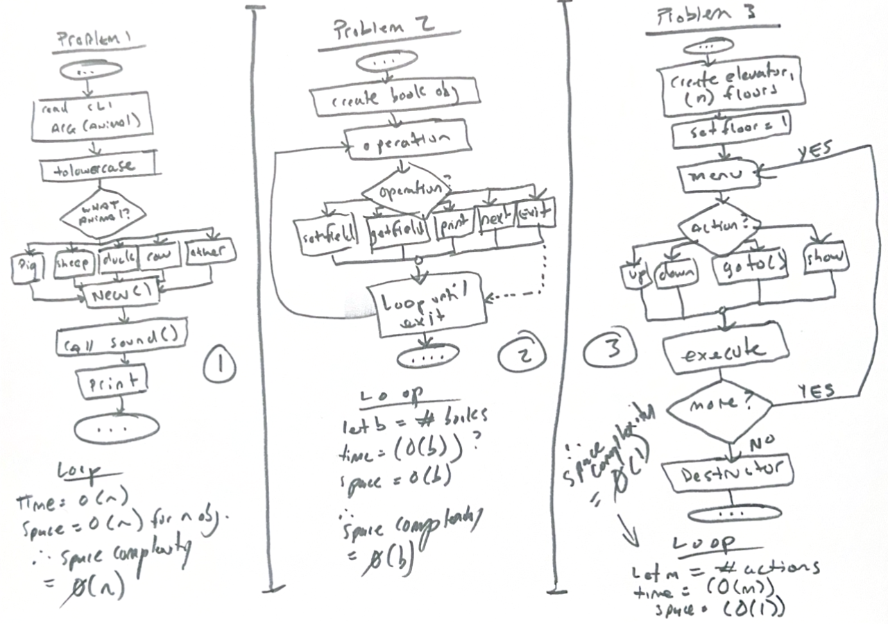
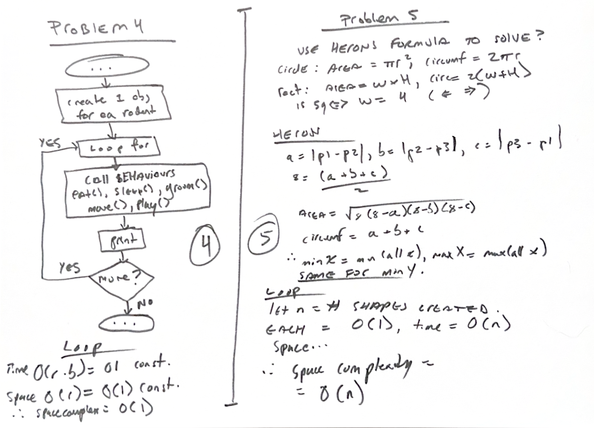

Assignment two journal
++++++++++++++++++++++++

+--------------+----------------------+
| Time spent   | Jan 2026 to Aug 2026 |
+--------------+----------------------+
| Student name | Hector Barquero      |
+--------------+----------------------+

.. tip::
   **How to use this journal**
   
   This journal section acts as an index, with the reading contents contained in the **Readings** chapter. You can use this to jump to the correct chapter, and it organizes the Unit 1 assignment journal components more cleanly rather than having them duplicated.

Program design
===============

Animal inheritance and sounds
~~~~~~~~~~~~~~~~~~~~~~~~~~~~~
- Added an Animal base class with a default constructor and generic sound() method. (v1.0)
- Added Pig, Sheep, Duck and Cow child classes with animal-specific constructors and overridden sound() methods. (v1.0-v1.2)
- Created several instances of each animal and verified oink, baah, quack and moo output. (v1.2)
- Made sound() virtual so child sounds can be called through an Animal pointer. (v1.3)
- Added an AnimalTest class that creates the correct child object from command-line input. (v1.3-v1.5)
- Added support for mixed-case animal names and error handling for unknown animals or extra arguments. (v1.5-v1.7)
- Used unique_ptr<Animal> so the selected child object is cleaned up automatically. (v1.7)

Book class and private attributes
~~~~~~~~~~~~~~~~~~~~~~~~~~~~~~~~~
- Added a Book class with private title, ISBN, author, edition, publisher and publication-year attributes. (v1.0)
- Added public getter and setter methods for each private attribute. (v1.0-v1.2)
- Added a default constructor and a parameterized constructor for initializing Book objects. (v1.2-v1.3)
- Added display() to print all stored book information in a consistent format. (v1.3)
- Created three Book objects using both constructors and setter methods. (v1.3-v1.5)
- Verified that each object keeps its own values and that every getter returns the value assigned by its setter. (v1.5-v1.6)

Elevator construction, movement and cleanup
~~~~~~~~~~~~~~~~~~~~~~~~~~~~~~~~~~~~~~~~~~~~
- Added an Elevator class that stores the total number of floors and the current floor. (v1.0)
- Added a default constructor for a five-storey building and a parameterized constructor for custom building sizes. (v1.0-v1.2)
- Added moveTo() to move between floors and reject destinations outside the building range. (v1.2-v1.4)
- Added handling for requests to move to the elevator's current floor. (v1.4)
- Added a destructor that returns the elevator to floor one and prints the required cleanup message. (v1.4-v1.5)
- Tested default construction, upward movement, downward movement, invalid movement and repeated movement. (v1.5-v1.7)
- Used unique_ptr::reset() to demonstrate when a dynamically created Elevator object is destroyed in C++. (v1.7)

Rodent inheritance and behaviours
~~~~~~~~~~~~~~~~~~~~~~~~~~~~~~~~~
- Added a Rodent base class with common eat(), sleep(), groom() and move() behaviours. (v1.0)
- Added Mouse, Gerbil, Hamster and GuineaPig child classes. (v1.0-v1.2)
- Overrode only behaviours that differ for each rodent, while leaving common behaviours inherited from Rodent. (v1.2-v1.4)
- Added type() and demonstrateBehaviours() methods to identify each rodent and run all of its behaviours. (v1.4-v1.5)
- Stored the child objects in a vector of unique_ptr<Rodent> objects. (v1.5)
- Called each behaviour through Rodent pointers to verify runtime polymorphism. (v1.5-v1.7)
- Verified that inherited methods still run when a child class does not override a behaviour. (v1.7)

Points and shape hierarchy
~~~~~~~~~~~~~~~~~~~~~~~~~~
- Added a Point class with separate x and y values and show(), add() and subtract() methods. (v1.0)
- Added a Shape base class with virtual area(), circumference(), boundingBox() and display() methods. (v1.0-v1.2)
- Added Circle, Rectangle and Triangle child classes with default and parameterized constructors. (v1.2-v1.4)
- Implemented area and circumference calculations for each valid shape. (v1.4-v1.5)
- Added axis-aligned bounding-box calculations using minimum and maximum x and y coordinates. (v1.5)
- Added constructor validation for positive circle radii, non-collinear triangles and four-sided shapes that satisfy rectangle rules. (v1.5-v1.7)
- Added floating-point tolerance checks so calculated lengths and angles are not compared using exact equality. (v1.7)
- Added square detection when all four rectangle sides have equal length. (v1.7-v1.8)
- Tested valid circles, rectangles and triangles, along with an invalid circle, a non-rectangle quadrilateral, a square and a collinear triangle. (v1.8-v2.0)

Overview and reflections
=========================

Unit 4: Points to ponder
~~~~~~~~~~~~~~~~~~~~~~~~~
Hector Barquero posted Mar 4, 2026 3:41 PM
https://learning.athabascau.ca/d2l/le/18658/discussions/threads/341404/View

This unit goes over some fundamentals that were covered in depth within COMP200. If you read the COMP200 text then you'd be pretty prepared to go through this unit with little difficulty. 

Control flow and conditions are very familiar to whichever language you may already know, since the history of structured programming and C-based adoption

Unit 5: Points to ponder
~~~~~~~~~~~~~~~~~~~~~~~~~
Hector Barquero posted Mar 4, 2026 4:18 PM
https://learning.athabascau.ca/d2l/le/18658/discussions/threads/341427/View

This unit went further into recursion. One of the most interesting things this unit was remembering overloading. 

Javascript doesn't do this conventionally. You can write a design pattern to simulate overloading, but ultimately it's run-time evaluation whereas C++ is compile time. You can overload in C++ which is really handy, and something I almost forgot.

This will let me enjoy similar js-like flexibility when writing functions, since multiple functions can share the same name but with different parameters.

Unit 6: Points to ponder
~~~~~~~~~~~~~~~~~~~~~~~~~
Hector Barquero posted Mar 21, 2026 7:13 AM
https://learning.athabascau.ca/d2l/le/18658/discussions/threads/350429/View

This unit was a lot of reading, especially the additional and further reading. One of the most interesting parts I learned from reading it all was that loop choice encodes intent, and not capability. I've been selecting the wrong control flow all this time and now see that even though it expresses the same logic, maintenance and readability suffers.

I should be using bounded iteration (for) where it makes sense, not by default. Condition driven control (while), and once executed (do while) make a lot more sense for state transitions when I go back to read my code, but I must have picked up a habit of using bounded iteration primarily.

It also helps because the cognitive load of reading it is a bit worse when choosing the wrong control flow design. You can get earlier returns with the right one.

Readings
=========

Unit 4
~~~~~~~

.. rubric:: ThinkCScpp 4.1: The modulus operator

- The modulus operator ``%`` returns the remainder from integer division.
- It is useful for divisibility tests, digit extraction, and repeating numeric patterns.

.. rubric:: ThinkCScpp 4.2: Conditional execution

- An ``if`` statement runs a block only when its condition evaluates to true.
- Conditions usually use comparison or logical operators.
- Conditional execution lets a program choose whether an action should occur.

.. rubric:: ThinkCScpp 4.3: Alternative execution

- An ``if`` and ``else`` statement selects exactly one of two possible paths.
- The ``else`` block runs only when the original condition is false.

.. rubric:: ThinkCScpp 4.4: Chained conditionals

- An ``if`` followed by ``else if`` branches can test several mutually exclusive cases.
- Conditions are checked from top to bottom until one succeeds.
- The final ``else`` can handle all remaining cases.
- Ordering matters when conditions overlap.

.. rubric:: ThinkCScpp 4.5: Nested conditionals

- A nested conditional places one decision inside another.
- Nesting is useful when a second test only matters after the first succeeds.
- Deep nesting can usually be simplified with combined conditions or early returns.

.. rubric:: ThinkCScpp 4.6: The return statement

- A ``return`` statement immediately ends the current function.
- A value-returning function uses ``return`` to send a result back to its caller.

.. rubric:: ThinkCScpp 4.7: Recursion

- Recursion occurs when a function calls itself to solve a smaller version of a problem.
- Every recursive function needs a base case that stops further calls.
- The recursive case must move toward the base case.
- Recursive solutions often mirror mathematical definitions or nested structures.

.. rubric:: ThinkCScpp 4.8: Infinite recursion

- Infinite recursion happens when recursive calls never reach a stopping condition.
- It eventually exhausts the call stack and causes the program to fail.
- Common causes include missing base cases and arguments that don't move toward termination.

.. rubric:: ThinkCScpp 4.9: Stack diagrams for recursive functions

- A stack diagram shows each active function call and its local variables.
- Every recursive call receives its own separate parameters and local storage.
- Calls are removed from the stack in reverse order when they return.
- Stack diagrams help trace how recursive results are assembled.

.. rubric:: RooksGuide 10: Conditionals

- Conditionals control which statements execute based on Boolean expressions.
- They allow programs to react differently to different data.
- Clear conditionals avoid duplicated logic and unnecessary nesting.

.. rubric:: RooksGuide 10.1: if, else, and else if

- ``if`` handles the first condition, ``else if`` checks alternatives, and ``else`` handles the remainder.
- Only the first matching branch in a chain executes.
- Braces make each branch's scope explicit.
- Conditions should be ordered from most specific to most general.

.. rubric:: RooksGuide 10.1.1: A small digression on expressions

- An expression combines values, variables, operators, and function calls to produce a result.
- Conditional expressions are converted to Boolean values.
- Nonzero numeric values act as true, while zero acts as false.

.. rubric:: RooksGuide 10.1.2: Using else

- ``else`` provides a fallback path when its matching ``if`` condition is false.
- An ``else`` belongs to the nearest unmatched ``if``.
- Braces prevent ambiguity in nested conditions.
- A final ``else`` can document that all possible cases were considered.

.. rubric:: RooksGuide 10.2: switch statements

- A ``switch`` selects a branch by comparing one expression against constant case values.
- ``break`` usually prevents execution from falling through into the next case.
- ``default`` handles values that don't match any listed case.
- ``switch`` is useful for discrete choices but can't directly express arbitrary ranges.
- Duplicate case values aren't allowed.

Unit 5
~~~~~~~

.. rubric:: ThinkCScpp 5.1: Return values

- A function's return value is the result supplied to its caller.
- The returned expression must be compatible with the declared return type.
- Return values can be stored, printed, compared, or passed into other functions.

.. rubric:: ThinkCScpp 5.2: Program development

- Incremental development builds and tests a program in small working steps.
- Each step should add one limited piece of behaviour.
- Frequent testing makes errors easier to locate.
- Temporary output can verify intermediate values.

.. rubric:: ThinkCScpp 5.3: Composition

- Composition uses one expression or function result as part of another operation.
- Small functions can be combined to solve larger problems.

.. rubric:: ThinkCScpp 5.4: Overloading

- Function overloading allows several functions to share a name when their parameter lists differ.
- The compiler selects the best matching overload from the supplied arguments.
- Return type alone can't distinguish overloads.
- Ambiguous calls produce compile-time errors.

.. rubric:: ThinkCScpp 5.5: Boolean values

- The ``bool`` type stores either ``true`` or ``false``.
- Comparisons produce Boolean results.
- Boolean values directly represent conditions instead of using numeric substitutes.

.. rubric:: ThinkCScpp 5.6: Boolean variables

- Boolean variables store the result of a condition for later use.
- Descriptive names such as ``isValid`` make decision logic easier to read.
- They can simplify repeated or complex expressions.

.. rubric:: ThinkCScpp 5.7: Logical operators

- ``&&`` requires both operands to be true, while ``||`` requires at least one.
- ``!`` reverses a Boolean value.
- Logical operators use short-circuit evaluation.
- Parentheses can clarify how several conditions are grouped.
- Operator precedence can affect results when logical expressions are combined.

.. rubric:: ThinkCScpp 5.8: Bool functions

- A Boolean function returns ``true`` or ``false`` to describe a condition.
- Predicate names usually read like questions, such as ``isEven`` or ``hasAccess``.
- Returning a comparison directly is often clearer than using an unnecessary ``if`` statement.
- Boolean functions make complex conditions reusable.

.. rubric:: ThinkCScpp 5.9: Returning from main

- Returning ``0`` from ``main`` conventionally indicates successful execution.
- A nonzero return value can indicate that the program ended because of an error.

.. rubric:: ThinkCScpp 5.10: More recursion

- Recursive functions can return values that depend on smaller recursive results.
- Each call pauses until the next call returns.
- Correct recursion requires both a valid base case and measurable progress.
- Repeated work can make some recursive solutions inefficient.

.. rubric:: ThinkCScpp 5.11: Leap of faith

- The recursive leap of faith assumes the smaller recursive call already works correctly.
- The current call then only needs to combine that smaller result into the full solution.
- This approach avoids tracing every recursive level while designing the function.

.. rubric:: ThinkCScpp 5.12: One more example

- A complete recursive example combines a base case, a smaller subproblem, and a returned result.
- Tracing several inputs helps confirm that each call moves toward termination.
- Comparing recursive and iterative versions can reveal differences in clarity and cost.
- Edge cases should be tested separately from typical inputs.

Unit 6
~~~~~~~

.. rubric:: ThinkCScpp 6.1: Multiple assignment

- Reassigning variables updates their stored values during execution.
- The right-hand expression is evaluated before the destination changes.
- Temporary variables may be needed when swapping values.
- Sequential assignments aren't simultaneous.

.. rubric:: ThinkCScpp 6.2: Iteration

- Iteration repeatedly executes statements while a condition remains true.
- Loops replace duplicated code when the same operation must occur many times.
- A loop usually needs initialization, a condition, and an update.

.. rubric:: ThinkCScpp 6.3: The while statement

- A ``while`` loop checks its condition before each iteration.
- Its body might not execute at all when the condition starts false.
- The loop body must eventually change something that affects the condition.
- Missing progress can create an infinite loop.
- ``while`` is useful when the number of iterations isn't known in advance.

.. rubric:: ThinkCScpp 6.4: Tables

- A table can be generated by repeating a calculation for a sequence of input values.
- Loops make the range and spacing of table entries easy to control.
- Formatted output keeps columns aligned and readable.

.. rubric:: ThinkCScpp 6.5: Two-dimensional tables

- Nested loops generate rows and columns in a two-dimensional table.
- The outer loop usually controls rows while the inner loop controls columns.
- The total work is approximately the product of the two loop counts.
- Each table cell can be calculated from its row and column values.

.. rubric:: ThinkCScpp 6.6: Encapsulation and generalization

- Encapsulation moves a repeated block of logic into a named function.
- Generalization replaces fixed values with parameters.
- Together they turn one specific solution into reusable code.
- A generalized function should still have one clear responsibility.

.. rubric:: ThinkCScpp 6.7: Functions

- Functions divide a program into named operations with defined inputs and outputs.
- Parameters allow callers to supply data.
- Return values let functions produce reusable results.

.. rubric:: ThinkCScpp 6.8: More encapsulation

- Additional encapsulation can separate loop control from the work performed in each iteration.
- Smaller functions reduce duplication and make testing more focused.
- Extracting code is useful when a block has a meaningful independent purpose.
- Excessive fragmentation can make simple logic harder to follow.

.. rubric:: ThinkCScpp 6.9: Local variables

- Local variables exist only within the block or function where they're declared.
- Each function call receives its own local variables.
- Limiting scope prevents unrelated code from modifying temporary state.
- A local variable can hide another variable with the same name in an outer scope.
- Variables should be declared near their first use.

.. rubric:: ThinkCScpp 6.10: More generalization

- Further generalization identifies additional values or behaviours that can become parameters.
- A generalized function can handle a wider range of inputs without duplicating code.
- Generalization should preserve readability rather than create unnecessary abstraction.

Practice problems
===================
A full comprehensive list of practice problems can be found in :doc: Practice Problems <PracticeProblems.rst>

Unit 4 practice problems
~~~~~~~~~~~~~~~~~~~~~~~~

Fizz Buzz (Easy)
----------------

**Return each number as text, replacing multiples of three and five with the required words.**

.. code-block:: cpp

   class Solution {
   public:
       vector<string> fizzBuzz(int n) {
           vector<string> answer;

           for (int i = 1; i <= n; ++i) {
               if (i % 15 == 0) {
                   answer.push_back("FizzBuzz");
               } else if (i % 3 == 0) {
                   answer.push_back("Fizz");
               } else if (i % 5 == 0) {
                   answer.push_back("Buzz");
               } else {
                   answer.push_back(to_string(i));
               }
           }

           return answer;
       }
   };

Unit 5 practice problems
~~~~~~~~~~~~~~~~~~~~~~~~

Pow(x, n) (Medium)
------------------

**Calculate a floating-point base raised to an integer exponent using recursion.**

.. code-block:: cpp

   class Solution {
   public:
       double myPow(double x, int n) {
           return power(x, static_cast<long long>(n));
       }

   private:
       double power(double x, long long n) {
           if (n == 0) {
               return 1.0;
           }

           if (n < 0) {
               return 1.0 / power(x, -n);
           }

           double half = power(x, n / 2);

           if (n % 2 == 0) {
               return half * half;
           }

           return half * half * x;
       }
   };

Unit 6 practice problems
~~~~~~~~~~~~~~~~~~~~~~~~

Pascal's Triangle (Easy)
------------------------

**Generate the requested number of rows from Pascal's triangle using nested loops.**

.. code-block:: cpp

   class Solution {
   public:
       vector<vector<int>> generate(int numRows) {
           vector<vector<int>> triangle;

           for (int row = 0; row < numRows; ++row) {
               triangle.push_back(vector<int>(row + 1, 1));

               for (int column = 1; column < row; ++column) {
                   triangle[row][column] =
                       triangle[row - 1][column - 1] +
                       triangle[row - 1][column];
               }
           }

           return triangle;
       }
   };

Sources and references
=======================
.. add competitive c++ from leetcode?

1. cppreference.com. (n.d.). C++ reference. Retrieved Jan 2026 - Aug 2026, from https://cppreference.com/cpp

2. Braunschweig, D., & Busbee, K. L. (2018). Programming fundamentals: A modular structured approach (2nd ed.). Rebus Community. https://press.rebus.community/programmingfundamentals/

3. Hansen, J. A. (2013). The Rook’s guide to C++. Rook’s Guide Press. https://rooksguide.org/

4. Downey, A. B. (1999). Think C++ (Version 1.1.0). Green Tea Press. https://www.greenteapress.com/thinkcpp/

5. leetcode.com. (n.d.). *LeetCode*. Retrieved Jan 2025 - Aug 2026, from https://leetcode.com/